## Deploying with Ark Deployer

### Create a fork of ark core and ark explorer

More information about this process [here](https://deployer.ark.dev/prepare/preparing-github/)

### Create a server

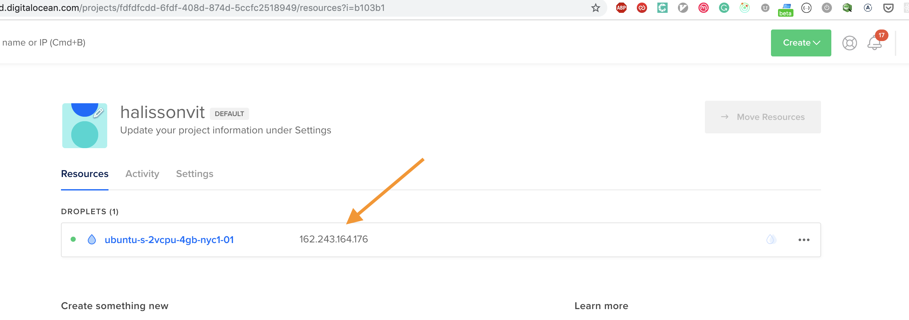

You can find more information about Server Requirements [here](https://deployer.ark.dev/prepare/getting-started/)

_Note: Make sure your server has access to your Github account. If you have a pub/private key configured, you won't be able to use email/password auth. https://help.github.com/en/articles/connecting-to-github-with-ssh_


### Prepare your server for the deployment

Create a new user to deploy/manage your node.

```sh
adduser bridgechain
usermod -aG sudo bridgechain
su bridgechain
```

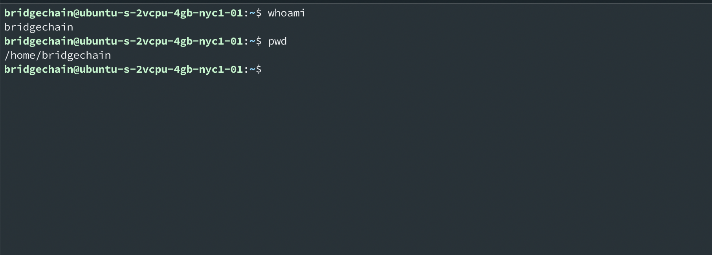

More information about this [here](https://deployer.ark.dev/prepare/preparing-your-server/)

### Preparing the deployment script

#### Go to https://deployer.ark.io/ and launch a new deployer.

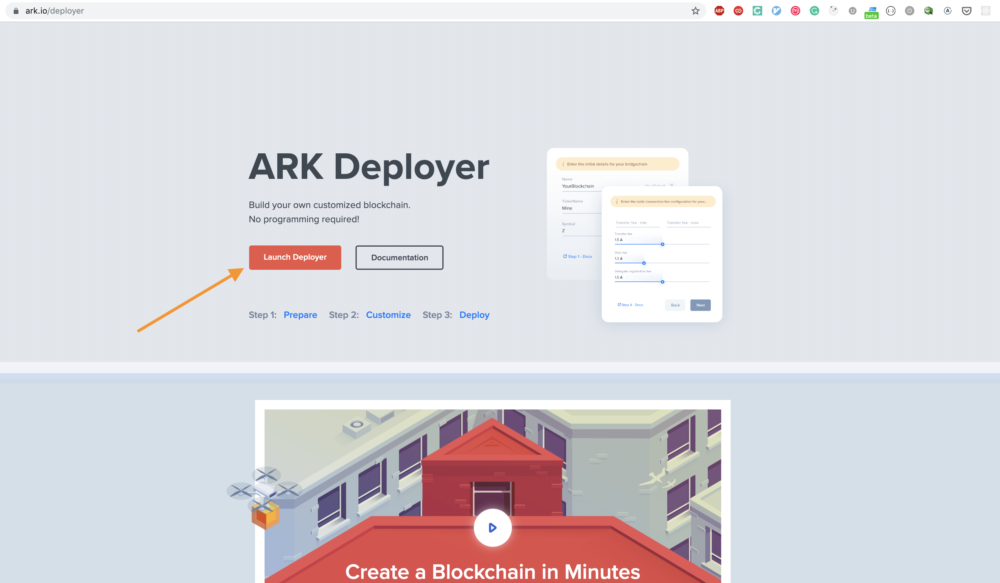

#### Click on "Create", then select the "Basic" level


#### Provide the information about your bridgechain


#### Provide the information about your forks of repo and explorer


_Note: If your github account has a pub/private key, make sure to use the ssh address of your repo_

#### Configure your server as a mainnet peer

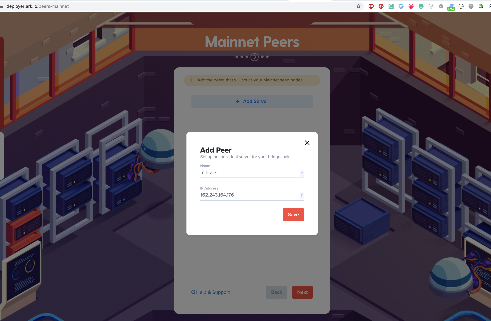

#### Configure your server as a devnet peer


#### Get the deployment script


And copy the content

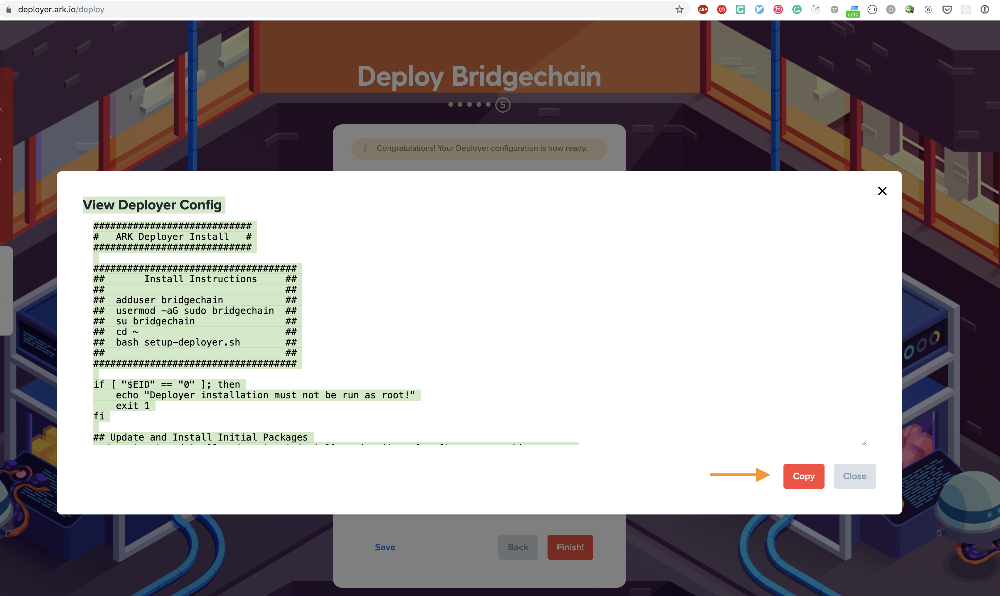


### Executing the deployment script

#### Create the deployment script

Connect to your server, then execute the commands below:

```sh
su bridgechain
cd ~
nano setup-deployer.sh 

# paste the content and save the file
```

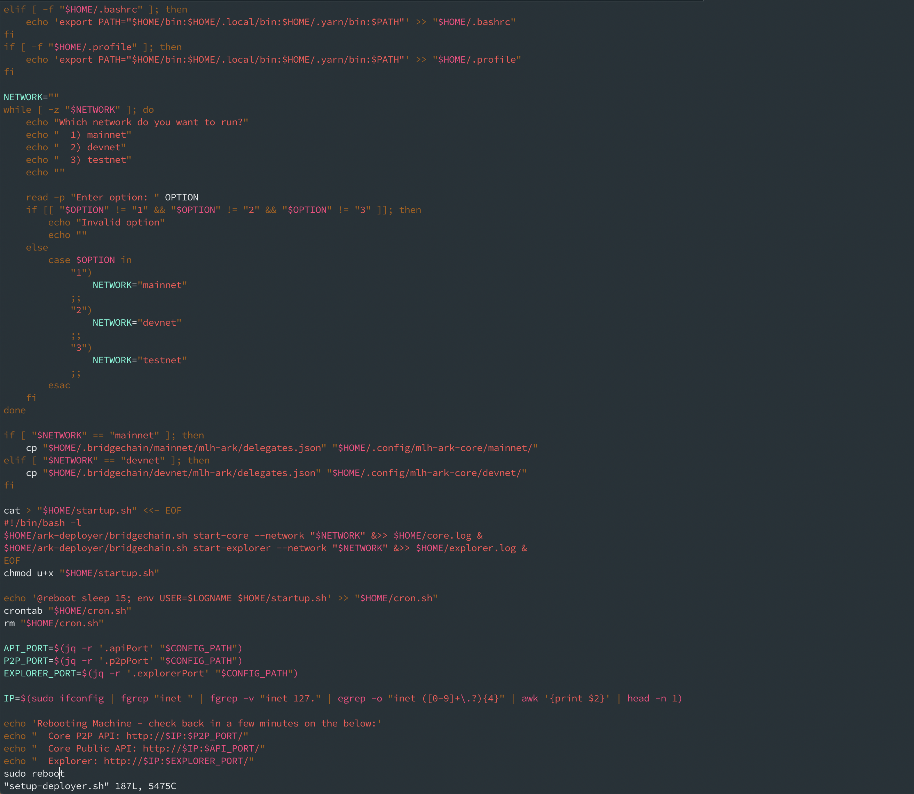

#### Execute the deployment script

```sh
su bridgechain
cd ~
bash setup-deployer.sh
```


At the end, choose `testnet` as the network to run.

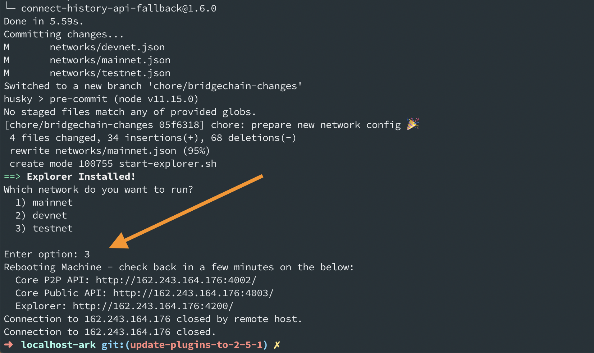

Make sure to scroll back, after execution finishes, and save the output of the wallets as we will need it to configure our taco-shop api.

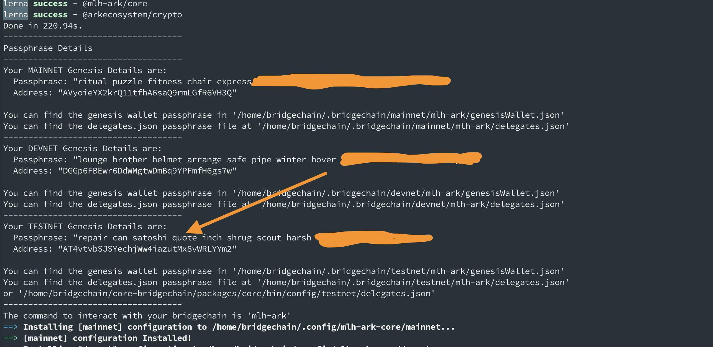


Your server will restart, wait a few minutes before you can test it.


More information about this process [here](https://deployer.ark.dev/deploy/transferring-and-executing-script/).


### Create a wallet and make some transferences to it

#### Add your network to Ark Desktop Wallet


More information about this process [here](https://deployer.ark.dev/deploy/adding-bridgechain-to-ark-desktop-wallet/#adding-network-to-ark-desktop-wallet)

#### Create Profile With Your Network in ARK Desktop Wallet


More information about this process [here](https://deployer.ark.dev/deploy/adding-bridgechain-to-ark-desktop-wallet/#creating-profile-with-your-network-in-ark-desktop-wallet)

#### Importing the Genesis Wallet Address

Here you will use the information you saved from the installer output. Make sure you use the output for the `testnet` network.

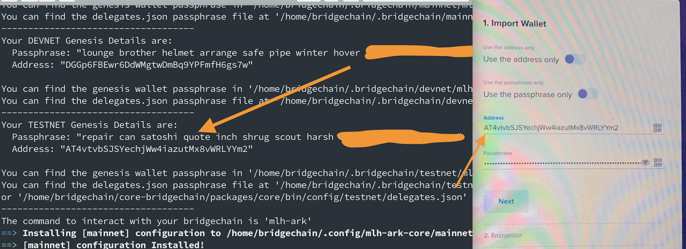

[](https://deployer.ark.dev/deploy/importing-genesis-addresses-and-adding-forgers/#importing-genesis-wallet-address)


#### Create a wallet for the taco-plugins

* Click on the profile image
* Click on Create Wallet
* Choose one of the provided address (Save this value)
* Click next
* Copy and save your passphrase
* Validate the flow
* Name your wallet
* Save


More information about this process [here](https://docs.ark.io/tutorials/usage-guides/how-to-use-ark-desktop-wallet.html#creating-or-importing-your-ark-wallet)

#### Send some tokens to your taco wallet

* Click on the wallets icon
* Select the genesis wallet
* Click on Send
* Use the taco wallet as the recipient
* Send 10000000
* Use the genesis passphrase (the one you saved from the installer output)


You can confirm the taco wallet has received the tokens by selecting the taco wallet.


More information about this process [here](https://docs.ark.io/tutorials/usage-guides/how-to-use-ark-desktop-wallet.html#wallet-interface)

### Install the taco-shop plugins

Connect to your server, make sure you are using the bridgechain user, and cd into the home.

```sh
su bridgechain
cd ~
```

Clone the localhost-ark project and move the plugins to the expected folder.

```sh
cd ~/core-bridgechain/plugins
git clone --branch v0.0.1 https://github.com/MLH/localhost-ark
mv ./localhost-ark/ark-taco-shop-api ./
mv ./localhost-ark/ark-taco-shop ./
rm -rf localhost-ark
```

Install the plugins dependencies.

```sh
cd ~/core-bridgechain
yarn setup
```

The plugins should be listed in the output.

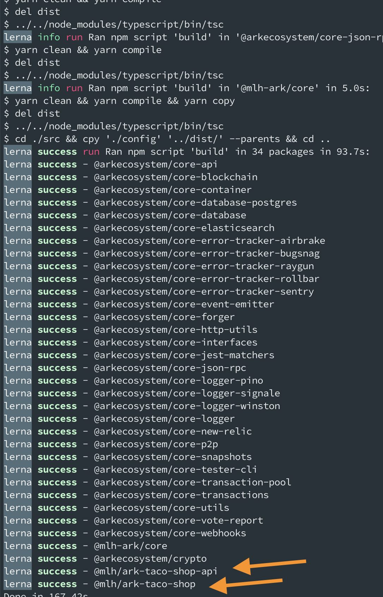

### Configure the plugins

Edit the file `~/.config/mlh-ark-core/testnet/plugins.js` and add the following:

```JSON

        '@mlh/ark-taco-shop-api': {
                enabled: true,
                server: {
                        enabled: true,
                        host: "0.0.0.0",
                        port: 5000,
                },
        },
        '@mlh/ark-taco-shop': {
                enabled: true,
                server: {
                        enabled: true,
                        host: "0.0.0.0",
                        port: 3000,
                },
                inventoryApi: {
                        sender: "REPLACE_THIS_VALUE_WITH_THE_TACO_ADDRESS",
                        passphrase: "REPLACE_THIS_VALUE_WITH_THE_TACO_PASSPHRASE",
                        recipient:  "REPLACE_THIS_VALUE_WITH_THE_GENESIS_ADDRESS",
                        uri: "http://0.0.0.0:5000/api",
                },
        },
```

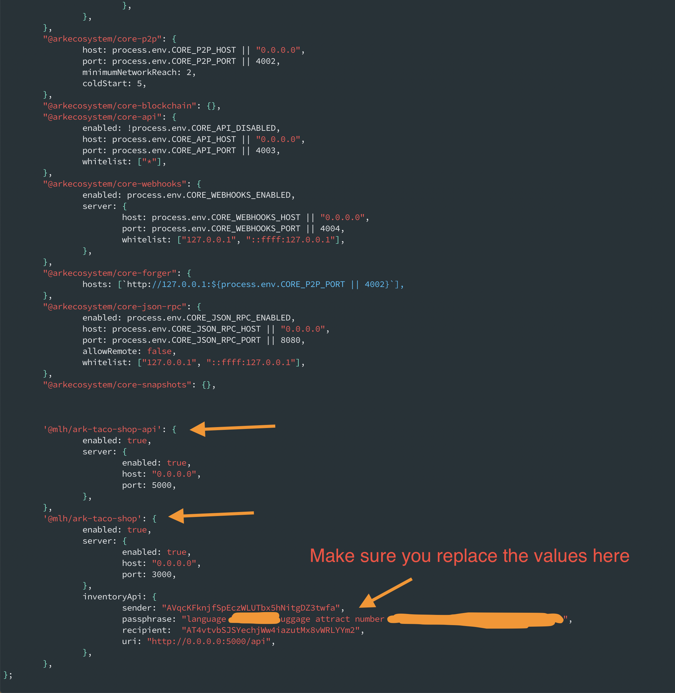

### Restart your Ark Core instance

```sh
pm2 restart all
```

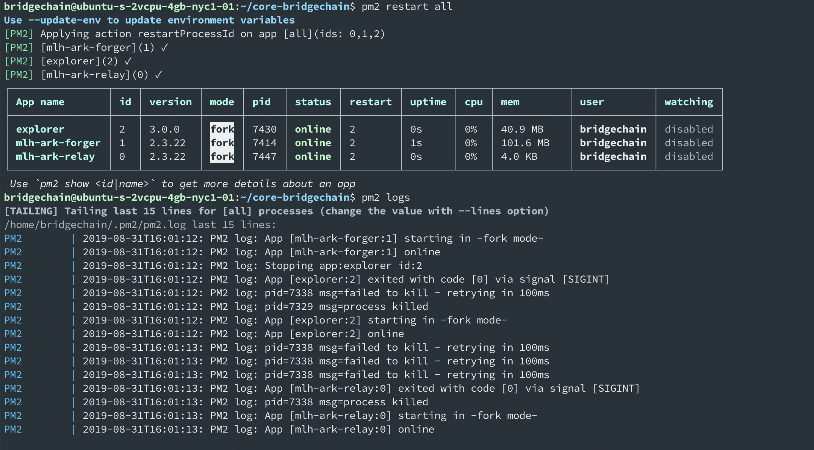

### Check the logs to see if the taco plugins started

```sh
pm2 logs
```

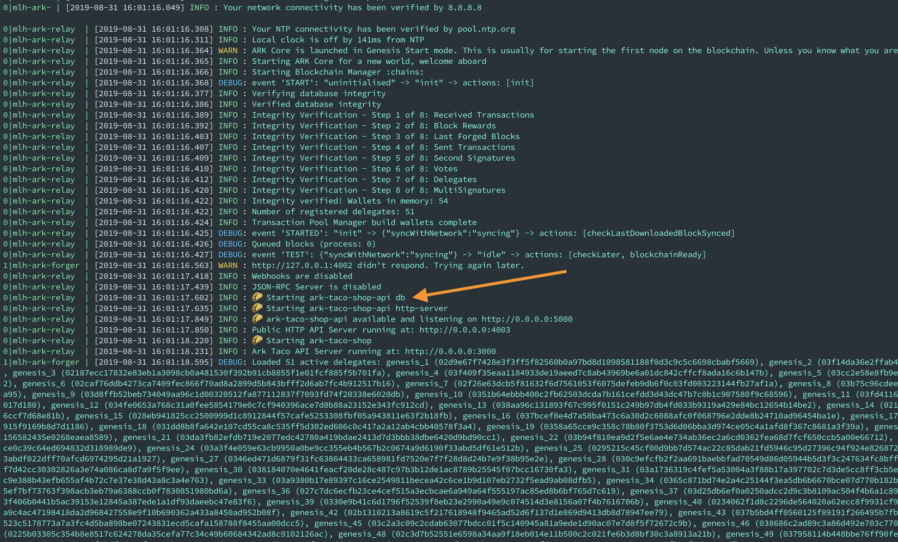

### Add products to the inventory

Open http://YOUR_SERVER_ADDRESS:5000/inventory

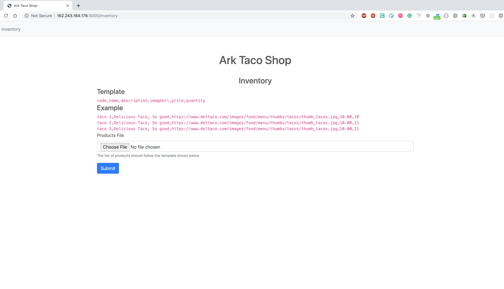

### Test the Taco Shop

Open http://YOUR_SERVER_ADDRESS:3000

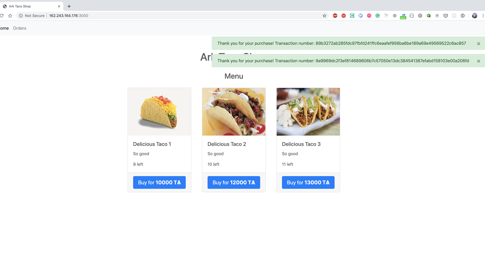